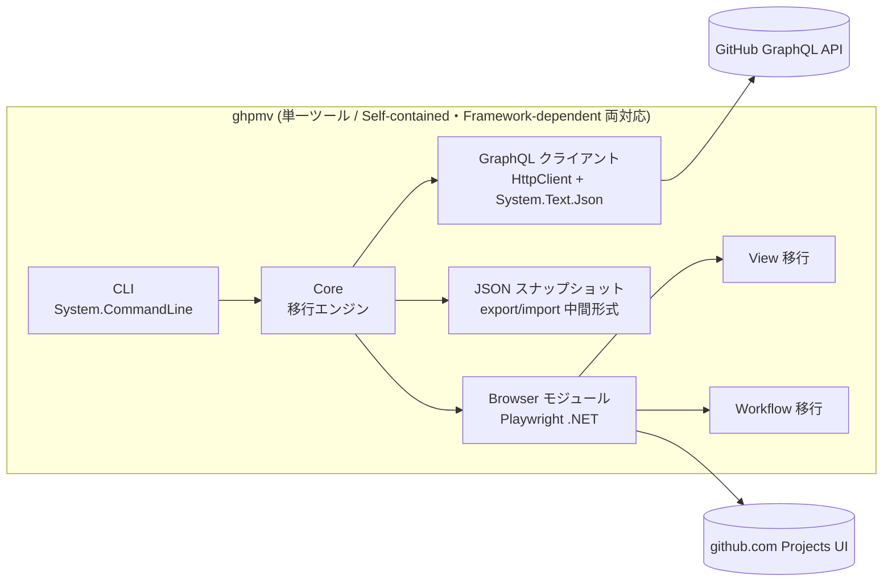

# github-project-migrator 開発プラン

GitHub Projects V2 を組織間/製品間で移行する CLI ツール。
[junkofujiwara/github-projects](https://github.com/junkofujiwara/github-projects) の後継として、手動ステップを排除した完全自動移行を目指す。

- 作成日: 2026-07-05
- ステータス: 調査完了 / 実装未着手

---

## 1. 仮説検証の結果(根拠付き)

> 仮説: 「Playwright を使えば、junkofujiwara/github-projects の手動実行が必要という制限事項をすべて自動実行に置き換えられる」

**判定: 部分的に正しい。** ただし前提が 2 年間で大きく変わっており、「Playwright が必要な範囲」は当時より大幅に縮小している。

### 1.1 旧ツールの手動ステップ(README より)

| 手動ステップ | 当時の理由 |
|---|---|
| Views の追加 | View 作成 API が存在しない |
| Iteration フィールドの追加 | `createProjectV2Field` が Iteration 非対応 ("Iteration type of fields is not supported due to API limitation") |

### 1.2 2026 年現在の GraphQL API の状況(docs.github.com GraphQL リファレンスで確認)

| 機能 | API 対応 | 根拠 |
|---|---|---|
| Project 作成 / 更新(README, 説明, public) | ✅ | `createProjectV2`, `updateProjectV2` |
| **Iteration フィールド作成** | ✅ **新規対応済み** | `CreateProjectV2FieldInput.iterationConfiguration` (`ProjectV2IterationFieldConfigurationInput`: `duration`, `startDate`, `iterations[]`) が現行スキーマに存在 |
| Single-select フィールド(色・説明付き) | ✅ | `ProjectV2SingleSelectFieldOptionInput` (`color`, `description`, `id` による option ID 保持) |
| **Status フィールドの option 書き換え** | ✅ | `updateProjectV2Field`(既存フィールドの `singleSelectOptions` 上書き可) |
| アイテム追加(Issue/PR/Draft) | ✅ | `addProjectV2ItemById`, `addProjectV2DraftIssue`(assignee 対応) |
| フィールド値の設定 | ✅ | `updateProjectV2ItemFieldValue`(text/number/date/single-select/iteration) |
| **アイテムの並び順** | ✅ | `updateProjectV2ItemPosition` |
| アイテムのアーカイブ状態 | ✅ | `archiveProjectV2Item` / `unarchiveProjectV2Item` |
| コラボレーター | ✅ | `updateProjectV2Collaborators` |
| リポジトリ/チームへのリンク | ✅ | `linkProjectV2ToRepository`, `linkProjectV2ToTeam` |
| Status update(進捗報告) | ✅ | `createProjectV2StatusUpdate` |
| **View の作成・設定** | ❌ **読み取り専用** | `ProjectV2View` は query のみ。`createProjectV2View` / `updateProjectV2View` はスキーマに存在しない(github/docs のスキーマデータを検索して不存在を確認) |
| **Workflow の作成・有効化** | ❌ **削除のみ可** | `deleteProjectV2Workflow` のみ存在。create/update は無い |

### 1.3 後発ツールの状況(車輪の再発明チェック)

[timrogers/gh-migrate-project](https://github.com/timrogers/gh-migrate-project)(v5.0.0, 2025-06, 活発にメンテ中)が本領域のデファクト。その Limitations にも:

> The following data is not migrated and will be skipped: **Views / The order of project items displayed in your views / Workflows / Iteration custom fields**

とあり、**Views と Workflows が API では移行不能**という本調査の結論と一致する。
→ 新ツールの差別化ポイントは「Views / Workflows まで含めた完全自動移行(Playwright 層)」である。

### 1.4 Playwright × .NET のパッケージング制約

- [microsoft/playwright-dotnet#2714](https://github.com/microsoft/playwright-dotnet/issues/2714): メンテナー回答「Playwright .NET は Node.js エンジンのラッパーであり、NativeAOT 対応の予定はない(意味がない)」→ Native AOT は採用しない(本ツールは AOT 非対象)
- [microsoft/playwright-dotnet#2255](https://github.com/microsoft/playwright-dotnet/issues/2255): single-file publish で例外(ドライバー展開の問題)→ **単一 .exe 化(PublishSingleFile)は避け、フォルダー形式で配布する**

**→ 通常の(JIT)ビルドであれば `Microsoft.Playwright` を単一ツールに直接組み込める。** Self-contained / Framework-dependent はどちらも publish オプションの違いだけで同一コードベース・同一プロジェクトから出力できる(§3 参照)。

### 1.5 結論

1. **移行データの ~90%(Project / Field(Iteration 含む)/ Item / 値 / 並び順)は現行 GraphQL API だけで完全自動化できる。** Playwright は不要。旧ツールの手動ステップのうち「Iteration フィールド」は API 進化により解消済み。
2. **Views と Workflows だけは API が存在せず、自動化にはブラウザー自動操作が唯一の手段。** ここに Playwright を使う仮説は正しい。
3. Native AOT は要件から外れたため、**Playwright をコアに直接統合した単一ツール**とし、Self-contained と Framework-dependent の 2 形態で同一バイナリ構成を配布する。

### 1.6 リスクと注意事項

| リスク | 影響 | 緩和策 |
|---|---|---|
| GitHub UI の DOM 変更で Playwright 層が壊れる | View/Workflow 移行の失敗 | Role ベースのセレクター採用、E2E テストを CI で定期実行、失敗時は「手動手順書の自動生成」へフォールバック |
| UI 自動操作の利用規約上の位置づけ | コンプライアンス | 自組織データのみ・レート制御・ヘッドフルオプション提供。README に明記し、View/Workflow 自動化はオプトイン(`--enable-browser-automation`)とする |
| ログイン(2FA / SSO / EMU) | 自動化の前提 | 初回のみ手動ログイン → `storageState` を保存・再利用。トークンでの UI ログインは不可のため必須手順として設計 |
| Windows ARM64 での Playwright ブラウザー | 対応状況が流動的 | API 移行機能は全 OS で動作保証。ブラウザー機能のみ「対応 OS 表」を分けて明記 |
| GitHub Enterprise Cloud with data residency(移行先) | API/Web のホストがテナント固有(`https://api.{tenant}.ghe.com` / `https://{tenant}.ghe.com`) | `--target-base-url` 対応。GHEC-DR は GitHub.com と同一の最新 API スキーマのため機能差分はない前提。統合テストで確認 |
| プラン別の機能上限(Auto-add workflow: Free=1 / Pro・Team=5 / GHEC=20。docs で確認済み) | Free org のテスト環境では複数 Auto-add の移行と上限超過ハンドリングを実地検証できない。移行先プランの上限超過時に import が失敗する | import 時にターゲットの作成結果から上限到達を検出し、超過分は warning + 手動手順書へフォールバック。複数 Auto-add の実地検証は Team 以上の org が使える場合のみ実施(なければ 1 個 + 上限検出ロジックの単体テストで代替) |

---

## 2. ツール概要

- 名称: `ghpmv` (github-project-migrator)
- 形態: .NET 10 コンソールアプリ(単一プロジェクト・単一ツール)。配布は 2 形態:
  - **Self-contained**: ランタイム同梱のフォルダー配布(zip/tar.gz)。ランタイムのインストール不要
  - **Framework-dependent**: .NET 10 ランタイムがある環境向けの軽量配布 + `dotnet tool install -g ghpmv`(NuGet グローバルツール)
  - ※ Playwright のドライバー展開問題([#2255](https://github.com/microsoft/playwright-dotnet/issues/2255))を避けるため `PublishSingleFile` は使わない
- 対応 RID: `win-x64`, `win-arm64`, `linux-x64`(+ 可能なら `linux-arm64`)。Framework-dependent 版はポータブル(RID 非依存)
- コマンド体系:

```
ghpmv export   --org <src> [--project <num>] [--out <dir>]        # ソースから JSON へ(--project 省略で全プロジェクト一括 → <out>/<number>/)
             [--owner-type organization|user] [--include-closed]
             [--token <t>] [--base-url https://api.{tenant}.ghe.com]  # GHEC with data residency 向け(未検証)
             [--enable-browser-automation] [--browser-profile source]
             # 完了時に repository-mappings.csv / user-mappings.csv テンプレートを <out> に生成(既存ファイルは上書きしない)
ghpmv import   --org <dst> [--in <dir>] [--enable-browser-automation]  # ターゲットへ適用
             [--owner-type organization|user]
             [--project-number <n>]                              # 既存プロジェクトへマージ(--on-conflict / --project-title と排他)
             [--project-title <title>]                           # スナップショットのタイトルを上書きして新規作成
             [--token <t>] [--browser-profile target]
             [--target-base-url https://api.{tenant}.ghe.com]    # GHEC with data residency 向け(未検証)
ghpmv verify   --org <dst> [--project <num>] [--in <dir>] [--token <t>]  # 移行結果の検証・差分レポート
             [--owner-type organization|user] [--target-base-url ...]
ghpmv login    [--profile <name>] [--base-url https://{tenant}.ghe.com]  # Playwright 用 storageState 取得(プロファイル別)
ghpmv setup    --browsers                                          # Playwright ブラウザーのインストール(初回のみ)
```

### 2.1 アカウントモデル(クロスアカウント移行)

移行元と移行先は**別アカウント・別認証**でよい(例: 移行元 = Non-EMU の個人アカウント、移行先 = EMU アカウント(with/without data residency))。

| レイヤー | 分離方法 |
|---|---|
| GraphQL トークン | export(ソース側)と import/verify(ターゲット側)は別コマンドのため、それぞれ `--token`(または環境変数)で別トークンを指定するだけでよい |
| ブラウザーセッション | storageState を**名前付きプロファイル**で管理(`ghpmv login --profile source` / `--profile target`、保存先 `%APPDATA%/ghpmv/browser-state.<profile>.json`)。EMU without DR はホストが github.com で同一のため、**ホスト別ではなくプロファイル別**の分離が必須 |

クロスアカウント時の前提と制約(README にも明記):
- `ghpmv` は Projects V2 移行ツールであり、リポジトリ / Issue / PR 本体とその metadata(labels, milestones, assignees, reviewers, parent/sub-issues, comments/history など)は GitHub Enterprise Importer(GEI) 等で先に移行済みである前提。Project の filter 文字列はそのまま移行し、target Issue/PR 側の metadata に依存して評価される。
- **Issue/PR item のリンクはターゲット側実行アカウントから見える repo に限る**。ソース org の repo がターゲットアカウントから不可視なら該当 item は warning + skip(リポジトリマッピング CSV でターゲット側に見える repo へ変換するのが基本方針)。v1 は repo mapping + **同一 Issue/PR number** で relink するため、GEI 等で番号が維持されていることが前提。
- **GHEC-DR テナントはテナント外(github.com)の repo をリンクできない** → DR 移行では repo-mapping が実質必須
- EMU のユーザー名は `_shortcode` 付き → ユーザーマッピング CSV で変換(assignee 解決)

対応環境: 移行元 = GitHub.com(Non-EMU / EMU)、移行先 = GitHub.com(Non-EMU / EMU)または GHEC with data residency(`{tenant}.ghe.com`)。移行元と移行先のアカウントは別々でよい。**GitHub Enterprise Server はサポートしない。**


## 3. アーキテクチャ



- **単一プロジェクト構成**: `Microsoft.Playwright` をコアが直接参照する。1 プロセスで完結し、実装・配布・エラーハンドリングがシンプル。
- **Browser モジュールは遅延初期化**: `--enable-browser-automation` 指定時のみ Playwright を起動。ブラウザーバイナリ未取得なら `ghpmv setup --browsers`(内部で `Microsoft.Playwright.Program.Main(["install", "chromium"])` を呼ぶ)への誘導メッセージを表示。API 移行のみのユーザーにはブラウザーダウンロードを要求しない。
- **publish 戦略**: 同一 csproj から `--self-contained true`(RID 別)と `--self-contained false`(ポータブル)の両方を出力。どちらもフォルダー形式(非 single-file)。加えて `PackAsTool` で NuGet グローバルツールとしても配布。
- 中間データ: `export` が書き出す JSON スナップショット(スキーマバージョン付き)。旧ツールの output 形式からのコンバーターも用意。

## 4. 移行カバレッジ設計

| データ | 手段 | 備考 |
|---|---|---|
| Project 本体(title, README, 説明, 公開状態) | GraphQL | |
| フィールド: TEXT / NUMBER / DATE / SINGLE_SELECT / ITERATION | GraphQL | Iteration は `iterationConfiguration`。完了済み iteration は startDate を過去日にして再現 |
| Status フィールド option(色・説明) | GraphQL | `updateProjectV2Field` で既定 option を上書き |
| Item(Issue / PR / Draft) | GraphQL | Issue/PR はリポジトリマッピング CSV + 同一 Issue/PR number で解決(GEI 等で target 側に同番号 item が存在する前提)。Draft は本文冒頭に元作成者・日時を注記 |
| フィールド値 | GraphQL | iteration 値は title マッチで新 iterationId に解決 |
| アイテム並び順 | GraphQL | `updateProjectV2ItemPosition` を順次適用 |
| アーカイブ状態 | GraphQL | 値設定後に `archiveProjectV2Item` |
| コラボレーター / リポジトリリンク | GraphQL + Playwright | import は `updateProjectV2Collaborators` / `linkProjectV2ToRepository`(ユーザー/リポジトリマッピング CSV 適用、解決不能は warning+skip)。**コラボレーターの読み取り API は存在しない**(`ProjectV2ActorConnection` は mutation payload のみ、実スキーマで確認 2026-07-06)ため API-only export は null。`--enable-browser-automation` 時は `/settings/access` UI から明示 project collaborator と role を export(`ravel-maurice-uo_sde` で検証済み、2026-07-06)。Base role / org owner / inherited access は `ghpmv` 対象外で、GEI と target org/team/repo/enterprise policy 側の責務。チームリンク(`linkProjectV2ToTeam`)はコラボレーターとは別概念で v1 対象外 |
| **Views(layout, filter, groupBy, sortBy, visibleFields, 列順)** | **GraphQL + Playwright** | export は原則 GraphQL。ただし Slice by / Field sum / Roadmap 設定は API に無く UI から読み取る。import は全項目 UI 操作。詳細: [docs/BROWSER_AUTOMATION_PLAN.md](docs/BROWSER_AUTOMATION_PLAN.md) |
| **Workflows(有効/無効, Auto-add ほか)** | **GraphQL + Playwright** | GraphQL で取れるのは name/number/enabled のみ。設定詳細(Status 値・フィルター・対象リポジトリ)は export/import とも UI。詳細: [docs/BROWSER_AUTOMATION_PLAN.md](docs/BROWSER_AUTOMATION_PLAN.md) |

v1 で扱わないものと将来対応は §8 のロードマップを参照。

## 5. 実装マイルストーン

各マイルストーンは「実装 → 自動テスト green → 次へ」を厳守。エージェントは各ステップ末尾のテストコマンドで自己検証する。

**テスト方針: 実 API ファースト。** テスト専用 org(`GHPMV_TEST_ORG`)を M0 で準備し、M1 以降のすべてのマイルストーンで実 GraphQL API に対するテストを主軸にする。モックは実 API で再現困難なケース(secondary rate limit、5xx、部分失敗からのレジューム等)に限定する。

### M0: リポジトリ基盤
- ソリューション構成: `src/Ghpmv.Cli`(エントリーポイント), `src/Ghpmv.Core`(移行エンジン + Browser モジュール), `tests/Ghpmv.Core.Tests`, `tests/Ghpmv.Integration.Tests`, `tests/Ghpmv.Browser.Tests`
- TFM `net10.0`。publish 検証: self-contained(3 RID)+ framework-dependent(ポータブル)の両方
- **テスト専用 org のセットアップ**: `GHPMV_TEST_ORG` + PAT を準備し、フィクスチャープロジェクト(全フィールド型・複数 View ・Workflow を含む)を作成するセットアップスクリプトを用意。CI には secrets として登録
  - **プラン要件**: Free org で M0〜M6 の全検証が可能(Views・組み込み Workflow・全フィールド型にプランゲートなし)。Auto-add workflow のみ個数上限がプラン依存(Free=1 / Team=5 / GHEC=20)のため、M7 の複数 Auto-add 検証だけ Team 以上が望ましい
- CI (GitHub Actions): build + test + 両 publish 形態をマトリクスで実施。統合テストも CI で常時実行(secrets が使えない fork PR のみ skip)
- ✅ 検証: `dotnet test` / `dotnet publish -c Release`(`--self-contained true -r win-x64` と `--self-contained false`)が成功し、実 API への疎通テスト(viewer クエリ)が green

### M1: GraphQL クライアント
- 生 GraphQL over HttpClient + `System.Text.Json`(リフレクションベースの重量級 GraphQL ライブラリは避け、依存を最小化)
- ページネーション(cursor)、レート制御(`X-RateLimit-*` + secondary rate limit の指数バックオフ)、`--base-url` / `--target-base-url` 対応(GitHub.com および GHEC with data residency `https://api.{tenant}.ghe.com`。**GHES は非サポート**)
- ✅ 検証: **実 API に対する統合テストが主軸**(フィクスチャープロジェクトのクエリ、100 件超のページネーション、認証エラー)。モックは secondary rate limit のバックオフ動作と 5xx リトライのみ(実 API では意図的に再現できないため)

### M2: export(読み取り)
- Project / Fields / Views / Workflows / Items / 値 / 並び順を JSON スナップショットへ
- 旧ツール(junkofujiwara/github-projects)の output JSON → 新スナップショットへのコンバーター(**M2 から分離し、v1 リリース前の独立タスクへ後送り** — 2026-07-05)
- ✅ 検証: **フィクスチャープロジェクトの実 export** → スナップショット内容を期待値(フィールド数・View 数・item 数・値)と照合。コンバーターのみ旧ツールの実出力ファイルを fixture として使用(これはモックではなく実データ)

### M3: import — Project & Fields
- Project 作成、README/説明適用、Iteration/Single-select 含む全カスタムフィールド作成、Status option 上書き
- 冪等性: 既存同名 project/field を検出して skip or update(`--on-conflict` オプション)
- ✅ 検証: 実 org への統合テスト(作成 → GraphQL で読み戻して照合 → `deleteProjectV2` でクリーンアップ)。過去日付 iteration の PoC(§7-1)もここで消化

### M4: import — Items & 値 & 並び順
- リポジトリ/ユーザーマッピング CSV、Draft issue 注記、iteration/option の ID 再解決、`updateProjectV2ItemPosition`、アーカイブ復元
- 進捗表示(items 数が多い場合)とレジューム(mapping ログによる再開)
- ✅ 検証: 統合テスト(小規模プロジェクトのフル移行 → `verify` で全項目一致)

### M5: verify コマンド
- ソーススナップショットとターゲット実体の差分レポート(フィールド・値・件数・並び順)
- ✅ 検証: 実 org 上で移行済みプロジェクトから意図的にフィールド/item を削除 → 差分が正しく検出されることを統合テストで確認

### M6: Browser モジュール — ログインと Views 移行(Playwright)

**詳細設計は [docs/BROWSER_AUTOMATION_PLAN.md](docs/BROWSER_AUTOMATION_PLAN.md) を参照(タスク分解 B0–B9、セレクター戦略、操作シーケンス、検証ループを定義済み)。**

- 着手前に Discovery フェーズ(B0/D0)でセレクターを実 UI で確定し、aria snapshot を `docs/ui-maps/` にコミット
- `ghpmv setup --browsers` / `ghpmv login`(storageState 保存)
- View の UI-export(Slice by / Field sum / Roadmap 設定)と View import(全レイアウト)
- ✅ 検証: B0–B5 の各テスト(fixture project への適用 → GraphQL + UI の read-back 照合)+ nightly CI

### M7: Browser モジュール — Workflows 移行

**詳細設計は [docs/BROWSER_AUTOMATION_PLAN.md](docs/BROWSER_AUTOMATION_PLAN.md) §4 を参照。**

- Workflow 詳細の UI-export(W-1〜W-9 の設定値読み取り)と import(Edit → 設定 → Save and turn on workflow)
- Auto-add の複数インスタンス(Duplicate)とプラン別上限のハンドリング(Free=1 / Pro・Team=5 / GHEC=20)。上限到達時は超過分を warning + 手動手順書出力へフォールバック
- テスト環境が Free org の場合: 複数 Auto-add の実地検証は 1 個に縮退し、上限検出・フォールバックはロジックの単体テストでカバー(§1.6 参照)
- ✅ 検証: B6–B9 の各テスト(適用 → GraphQL `workflows` + UI 再スクレイプの照合、ラウンドトリップ E2E)

### M8: 配布とリリース
- Release ワークフロー: GitHub Releases へ以下を公開
  - Self-contained(win-x64/win-arm64/linux-x64、フォルダー zip/tar.gz)
  - Framework-dependent(ポータブル zip)
  - NuGet グローバルツール(`dotnet tool install -g ghpmv`)
- チェックサム、`--version`、更新チェック(オプトアウト可)
- ドキュメント: README(制限事項・ToS 注意・対応環境表(GitHub.com ⇄ GitHub.com / GitHub.com → GHEC-DR。GHES 非サポート)・2 形態のインストール手順)
- ✅ 検証: リリース成果物を各 OS ランナーで起動するスモークテスト(`ghpmv --version`, `ghpmv export --help`)を self-contained / framework-dependent 両方で実施

## 6. テスト戦略まとめ

**基本方針: 実 API でテストできるものは実 API でテストする。** モックは「実 API では意図的に再現できない/してはいけないケース」のみに限定する。

GEI で repository / Issue / Pull Request を移行してから `ghpmv` の Project 移行を手動検証する end-to-end 手順は [docs/MANUAL_TEST_PLAN.md](docs/MANUAL_TEST_PLAN.md) を参照。

| レイヤー | 手法 | 実行条件 |
|---|---|---|
| 統合(実 API)— 主軸 | テスト専用 org(`GHPMV_TEST_ORG`)+ フィクスチャープロジェクト + 自動クリーンアップ | CI 常時(secrets のない fork PR のみ skip) |
| 単体(ロジック) | xUnit。マッピング解決・スナップショットのシリアライズ・差分計算など純粋なロジックのみ。HTTP 層のモックは不使用 | 常時 |
| モック(限定的) | secondary rate limit バックオフ、5xx リトライ、途中失敗からのレジューム—実 API で再現不能なケースのみ | 常時 |
| publish 妥当性 | self-contained(全 RID)+ framework-dependent の publish とスモーク起動を CI で実行 | 常時 |
| E2E(ブラウザー) | Playwright、storageState 利用 | `GHPMV_TEST_ORG` 設定時 + nightly |
| 移行忠実度 | `ghpmv verify` 自体を回帰テストとして利用 | 統合テスト内 |

実 API テストの運用ルール:
- テストごとに一意なプレフィックス付き project を作成し、`finally` で `deleteProjectV2`。残骸は nightly の掃除ジョブで削除
- レートリミット消費を抑えるため、統合テストは直列実行・小規模データ(items ≤ 20)で設計

## 7. 未確定事項(実装前に PoC で確認)

1. `iterationConfiguration` で**過去日付の iteration**(完了済み)を作成できるか → M3 の最初に実 API で確認
2. Projects UI の View 設定 DOM の安定性(`data-testid` の有無)→ M6 着手時に Playwright codegen で調査
3. Windows ARM64 での Playwright Chromium ネイティブ対応 → M6 で確認、不可ならブラウザー機能は win-x64/linux のみサポートと明記
4. GHEC with data residency テナントでの動作確認(GraphQL エンドポイント `https://api.{tenant}.ghe.com/graphql`、Projects UI の DOM が GitHub.com と同一か、storageState のドメイン分離)→ DR テナントを利用できる段階で検証。それまでは「設計上対応・未検証」と README に明記
4b. クロスアカウント移行(Non-EMU ソース → EMU ターゲット、without DR)の実地検証 → 現テスト環境(ghpmv-source/ghpmv-target は EMU 配下)+ Non-EMU アカウント(SIkebe)の組み合わせで検証可能。ブラウザープロファイル分離(§2.1)の E2E を含める
5. Self-contained publish 時に Playwright ドライバー(.playwright フォルダー)が正しく成果物に含まれるか → M0 の publish 検証に含める

## 8. スコープとロードマップ(v1 対象外と将来対応)

### 8.1 v1 対象外 → v1.x で対応(API だけで実現可能。実装コスト小)

| 項目 | v1 で除外する理由 | 将来の対応方法 |
|---|---|---|
| Status updates(進捗報告の履歴) | コア移行の優先度を下げないため | `statusUpdates` query + `createProjectV2StatusUpdate` で移行可能と確認済み(§1.2)。作成者・日時は実行者・実行時になるため本文冒頭に元情報を注記(Draft issue と同方式) |
| ユーザープロジェクト(user-owned) | v1 は org → org に集中 | **→ 対応済み(2026-07-05)**: `export`/`import`/`verify` に `--owner-type organization\|user` を追加。GraphQL の `organization(login:)` を `user(login:)` に切替え、`createProjectV2` の `ownerId` に User ID を渡す(URL は API が返す `/users/{user}/projects/{n}` 形式をそのまま表示) |
| プロジェクトテンプレート属性 | ニッチ用途 | `markProjectV2AsTemplate` を import 後に 1 回呼ぶだけ(org プロジェクト限定) |
| View タブの並び順再現 | UI の D&D のみで壊れやすい | v1 は view number 昇順作成 + 警告。v1.x で `Locator.DragToAsync` によるタブ D&D を B-タスクとして追加(D0 で取得済みの aria 情報を活用) |
| 複数プロジェクトの並列移行 | レート制御とセッション管理が複雑化 | v1 は直列のみ。v1.x で API 部分のみ並列化(ブラウザー操作は常に直列を維持) |

### 8.2 v1 対象外 → v2 候補(調査・設計が別途必要)

| 項目 | v1 で除外する理由 | v2 でのアプローチ案 |
|---|---|---|
| Insights(チャート) | 読み書きとも API がなく、チャート設定 UI が View より複雑 | View と同じ UI-export/import 方式を適用。D0 と同様の Discovery(§BROWSER_AUTOMATION_PLAN §2)を `/insights` に対して実施し、チャート名/型/フィルター/X軸/グループをインベントリ化してから着手 |
| disabled workflow への設定適用 | 「保存 = 有効化」の UI 動線しかない可能性(D0 で確定) | D0 の結果次第。不可の場合は「一旦有効化して保存 → 直後にトグルで無効化」の 2 ステップ方式を v2 で検証(一瞬の有効化で副作用が出ないかの確認が必要なため v1 では見送り) |
| 組織レベル Issue Fields 連携 | 2025 以降の新機能で利用実態が少ない | `createProjectV2IssueField`(確認済み、§1.2)で API 移行可能。ただし前提となる org 側 IssueField の移行が別途必要なため、org 設定移行とセットで v2 にて設計 |
| memex 内部 API の直接利用 | 非公開・無保証 | UI 操作の破損頻度が高い場合の代替手段。D0 で記録する HAR を基に、壊れた項目単位での部分採用を判断(全面依存はしない) |
| GHEC-DR → GitHub.com など逆方向/DR 間移行 | v1 の検証対象外 | アーキテクチャ上は base-url の組み合わせで動くはず。DR テナントでの検証(§7-4)完了後にサポートマトリクスを拡張 |

### 8.3 恒久的な制限(ツールでは解決不能。README に明記)

| 項目 | 理由 |
|---|---|
| Draft issue / Status update の元の作成者・作成日時の保持 | API 上作成者は常に実行者になる。本文への注記で代替 |
| アイテムの変更履歴・フィールド値の盤面外履歴 | 履歴を書き込む API は存在しない |
| Issue/PR 本体と metadata の移行 | 本ツールのスコープ外(GitHub Enterprise Importer の役割)。`ghpmv` はリポジトリマッピング CSV + 同一 Issue/PR number で Project item を接続し、View filter は文字列として移行するだけで labels/milestones/assignees 等は書き換えない |
| GitHub Enterprise Server 対応 | 方針として非サポート(§2) |
| REDACTED アイテム(権限不足で隠された item) | export 実行者に見えないものは移行不能。件数を warning で報告 |

※ docs/BROWSER_AUTOMATION_PLAN.md §8 の「v1 スコープ外」は本節と対応付けて管理する(タブ並び順 → §8.1、disabled workflow / 内部 API → §8.2)。
