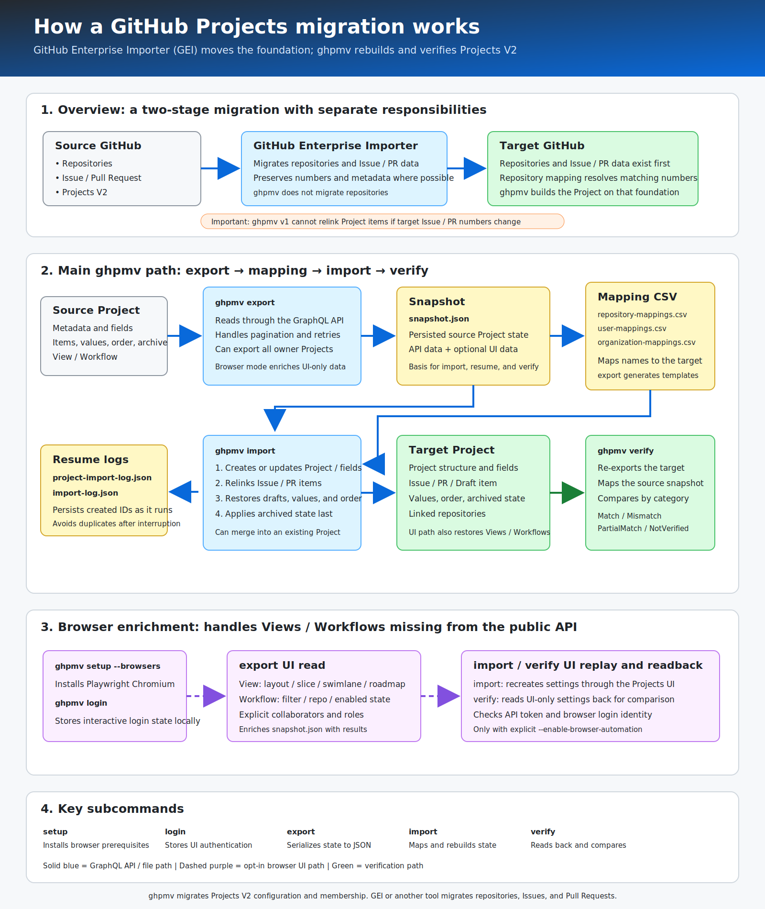

# ghpmv — GitHub Projects Migrator

`ghpmv` is a CLI that migrates **GitHub Projects V2** between organizations — **including Views and Workflows**, which have no public API.

Most existing tools (e.g. [timrogers/gh-migrate-project](https://github.com/timrogers/gh-migrate-project)) migrate what the GraphQL API exposes: fields, items and field values. Views (layout, filters, grouping, slicing, roadmap settings, …) and Workflows (auto-add, item-closed automation, …) must then be recreated by hand. `ghpmv` closes that gap with an **opt-in browser automation module** (Playwright + your own signed-in session) so a project can be migrated end-to-end:

| Capability | gh-migrate-project | ghpmv |
|---|---|---|
| Fields / items / field values | ✅ | ✅ |
| Draft issues (with author note) | ✅ | ✅ |
| Iteration fields incl. completed iterations | ➖ | ✅ |
| Item order & archived state | ➖ | ✅ |
| **Views (all layouts, filters, grouping, slicing, roadmap)** | ❌ | ✅ (opt-in browser automation) |
| **Workflows (auto-add, auto-archive, item state automations)** | ❌ | ✅ (opt-in browser automation) |
| Post-migration verification (`ghpmv verify`) | ❌ | ✅ |

## Migration flow

The following diagram shows how GitHub Enterprise Importer and the main `ghpmv` subcommands work together:



## Installation

Requires no runtime for the self-contained builds; the portable build and the global tool require the [.NET 10 runtime/SDK](https://dotnet.microsoft.com/download).

### Option 1: Self-contained archive (no .NET required)

Download the archive for your platform from [Releases](https://github.com/SIkebe/ghpmv/releases), verify it against `SHA256SUMS.txt`, extract it and run `ghpmv` (`ghpmv.exe` on Windows):

- `ghpmv-vX.Y.Z-win-x64.zip`
- `ghpmv-vX.Y.Z-win-arm64.zip`
- `ghpmv-vX.Y.Z-linux-x64.tar.gz`

### Option 2: Framework-dependent archive (portable, needs .NET 10)

Download `ghpmv-vX.Y.Z-portable.zip`, extract, and run:

```
dotnet ghpmv.dll --version
```

### Option 3: .NET global tool

```
dotnet tool install -g ghpmv
ghpmv --version
```

> NuGet.org publishing may lag behind GitHub Releases; the release assets are always the source of truth.

## Quick start

```bash
# 1. Export the source project to a JSON snapshot
ghpmv export --org source-org --project 7 --out ./snapshot --token $SOURCE_TOKEN

# 2. Import the snapshot into the target organization
ghpmv import --org target-org --in ./snapshot --token $TARGET_TOKEN \
  --repo-mapping repos.csv --user-mapping users.csv --org-mapping orgs.csv

# 3. Verify the migrated project against the snapshot
ghpmv verify --org target-org --project 12 --in ./snapshot --token $TARGET_TOKEN \
  --repo-mapping repos.csv --user-mapping users.csv --org-mapping orgs.csv
```

Tokens are resolved from `--token`, then the `GITHUB_TOKEN` / `GHPMV_TOKEN` environment variables.

`verify` reports an overall result and a result for Project, Field, Item, View, Workflow, Collaborator, and LinkedRepository:

| Result | Meaning |
|---|---|
| `Match` | Every available category was verified with no material difference. |
| `Mismatch` | At least one migration-owned value differs. |
| `PartialMatch` | No errors, but a non-fatal warning exists (for example, target-only data). |
| `NotVerified` | Required source or target data was not captured, so full equality cannot be established. |

`Mismatch` and `NotVerified` always produce exit code 1. `--fail-on-warning` also fails when warnings exist. Use `--report-json <path>` for the same overall/category results and counts in machine-readable form. Without browser automation, GraphQL-readable View settings are still compared, but UI-only View/Workflow settings and explicit collaborators are reported as `NotVerified`; use `--enable-browser-automation` when verification must prove those areas too. Explicit collaborator capture also requires the browser/token user to access the Project's **Settings → Manage access** page; GitHub requires a project admin or organization owner to [manage access to an organization Project](https://docs.github.com/en/issues/planning-and-tracking-with-projects/managing-your-project/managing-access-to-your-projects).

| Category | Verification coverage |
|---|---|
| Project | Description, README, visibility, and closed state. A changed title is informational because import supports title overrides. |
| Field | Field presence/type, single-select option order/name/color/description, and iteration dates/durations. |
| Item | Counts/types, issue and pull request identity, draft body, field values, active-item order, and archived state. Archived-item order is excluded because GitHub cannot restore it. |
| View | Name/layout plus GraphQL filter, visible fields/order, grouping, and sorting. Browser mode adds slice, swimlanes, field sums, and roadmap dates/zoom/markers. |
| Workflow | Name/enabled state. Browser mode adds content types, status, filter, and repository. |
| Collaborator | Browser-captured explicit user/team collaborators and roles. Inherited and base-role access is excluded. |
| LinkedRepository | Linked repository identities after repository mapping. |

Insights charts, item/field-value history, and inherited/base-role access are not verified.

### Token permissions

This section covers the normal migration commands: `export`, `import`, and `verify`. You do **not** need permission to create repositories, Issues, or pull requests for a normal Project migration; move or create the target repositories separately before running `ghpmv import`.

Use separate source and target tokens when the resource owners or accounts differ. The source token only needs the `export` permissions. The target token needs the union of the `import` and `verify` permissions.

#### Classic PATs

GitHub documents `read:project` for Project queries and `project` for queries and mutations. The classic `repo` scope is only needed when the migration must access private repository content; it grants broad read/write repository access, so prefer fine-grained PATs when practical. See [Using the API to manage Projects](https://docs.github.com/en/issues/planning-and-tracking-with-projects/automating-your-project/using-the-api-to-manage-projects#authentication) and [Scopes for OAuth apps](https://docs.github.com/en/apps/oauth-apps/building-oauth-apps/scopes-for-oauth-apps).

| Command | Classic PAT scopes |
|---|---|
| `ghpmv export` | `read:project`. Add `repo` when the source Project contains items or linked repositories from private repositories. |
| `ghpmv import` | `project`. For an organization-owned target, also add `read:org` because `ghpmv` resolves the organization node ID. Add `repo` when resolving items or linked repositories in private target repositories. |
| `ghpmv verify` | `read:project`. Add `repo` when the target Project contains items or linked repositories from private repositories. |

Authorize the token for organizations or enterprises that require SSO, including SAML- or OIDC-backed environments.

#### Fine-grained PATs

Use fine-grained PATs only for **organization-owned** Projects. GitHub lists access to Projects owned by a user account as a current [fine-grained PAT limitation](https://docs.github.com/en/authentication/keeping-your-account-and-data-secure/managing-your-personal-access-tokens#fine-grained-personal-access-token-limitations); use a classic PAT for `--owner-type user`.

Create each fine-grained token for the organization that owns the source or target Project. Grant repository access to every repository that can appear as a Project item or linked repository; selecting all repositories for that resource owner is the simplest option during a migration. See GitHub's [Permissions required for fine-grained personal access tokens](https://docs.github.com/en/rest/authentication/permissions-required-for-fine-grained-personal-access-tokens).

| Command | Fine-grained PAT permissions |
|---|---|
| `ghpmv export` | **Organization permissions → Projects: Read-only**. **Repository permissions → Metadata: Read-only**, plus **Issues: Read-only** and **Pull requests: Read-only** for private repositories that contain project items. |
| `ghpmv import` | **Organization permissions → Projects: Read and write**. **Repository permissions → Metadata: Read-only**; add **Contents: Read and write** for linked repositories, plus **Issues: Read-only** and **Pull requests: Read-only** for private repositories referenced by `--repo-mapping` or auto-add workflows. If you import project collaborators that include teams, also grant **Organization permissions → Members: Read-only** when required to resolve those teams. |
| `ghpmv verify` | Same as `ghpmv export` for the target project. |

GitHub does not publish fine-grained PAT requirements for each Projects GraphQL mutation. The **Contents: Read and write** requirement for `linkProjectV2ToRepository` is based on ghpmv's live GitHub testing: read-only Contents access was insufficient. GitHub separately documents a Contents permission for GitHub App installation tokens when `createProjectV2` links a repository, but that guidance is not PAT-specific and does not document `linkProjectV2ToRepository`.

GitHub permissions are still enforced in addition to token permissions: the token owner must be allowed to read the source project and referenced repositories, and must be allowed to create or edit the target project. [Changing an organization Project's visibility](https://docs.github.com/en/issues/planning-and-tracking-with-projects/managing-your-project/managing-visibility-of-your-projects) requires an organization owner or project admin, and an organization can restrict the operation to owners; import skips the visibility mutation when the target already matches the snapshot.

> `ghpmv setup --fixture` is a maintainer/test command, not a migration prerequisite. It creates a demo repository, Issues, a pull request, and a Project, so it intentionally needs broader permissions. See [Fixture credentials](#fixture-credentials-maintainers-only).

`--repo-mapping` / `--user-mapping` / `--org-mapping` map repositories, user logins, and organizations across deployments. They are especially important for EMU targets, where user logins normally gain a `_shortcode` suffix. Repository and organization mappings use the `source,target` header. User mappings use the GitHub Enterprise Importer mannequin reclaim header (`mannequin-user,mannequin-id,target-user`); the mannequin ID is ignored. `ghpmv export` generates ready-to-fill `repository-mappings.csv`, `organization-mappings.csv`, and, when users are present, `user-mappings.csv`. Candidates include linked and Auto-add repositories plus identifiers found in View and Workflow filters. Existing files are never overwritten, and newly discovered candidates are reported. During browser-assisted import, `assignee:`, `author:`, `repo:`, and `org:` filter values are mapped structurally; other syntax is preserved. Organization mappings are also inferred from repository owners when unambiguous. Browser-assisted import stops before any project write when a supported filter value or Auto-add repository remains unmapped or ambiguous. API-only imports do not replay or validate UI-only Workflow settings. Pass the same mappings to `ghpmv verify`.

### More import/export options

```bash
# Export ALL projects of the org at once (one snapshot per project under <out>/<number>/)
ghpmv export --org source-org --out ./snapshots            # add --include-closed to include closed projects
ghpmv import --org target-org --in ./snapshots/7           # then import each snapshot individually

# Import into an EXISTING project (fields/items are merged; the project keeps its title)
ghpmv import --org target-org --in ./snapshot --project-number 42 \
  --repo-mapping ./snapshot/repository-mappings.csv

# Create the project under a different title
ghpmv import --org target-org --in ./snapshot --project-title "Roadmap (migrated)"
```

`--project-number` is mutually exclusive with `--on-conflict` and `--project-title`.

When a project with the same title already exists, `--on-conflict` controls the entire import:

| Value | Result | Existing project changes |
|---|---|---|
| `fail` (default) | Exits with an error | None |
| `skip` | Exits successfully with `result=skipped` | None; items, fields, metadata, collaborators, linked repositories, views, and workflows are not imported |
| `update` | Exits successfully with `result=updated` | Applies the snapshot, including items and browser-assisted views/workflows when enabled |

Creating a new project emits `result=created`. The result line also includes the target project number for machine-readable automation, for example `result=skipped project=42`.

### Recovering from an ambiguous mutation result

Read-only GraphQL queries and explicitly idempotent updates are retried after transient network or server failures. Resource-creation mutations are not: if GitHub may have accepted a mutation but its response was lost, `ghpmv` exits with `Mutation result is ambiguous` instead of risking a duplicate. The error includes the operation, target, and a non-secret client mutation ID; mutation variables and tokens are never included.

Inspect the named target operation in GitHub before retrying. Rerun with the same snapshot directory so `project-import-log.json` and `import-log.json` can reconcile pending work. Project, custom-field, Draft, and Issue/PR item creation atomically records an operation and matching target baseline before sending. On resume, `ghpmv` polls for and adopts exactly one new match; no match or multiple matches stop the import for manual reconciliation instead of resending.

If the target project was created before the interruption, resume with `--on-conflict update`; when the original import targeted an existing project, pass the same `--project-number`. The default `--on-conflict fail` and `skip` modes intentionally do not modify an existing project and therefore cannot continue pending field or item reconciliation.

### User-owned projects

`export` / `import` / `verify` accept `--owner-type user` to migrate projects owned by a user account instead of an organization (URLs use the `/users/<login>/projects/<n>` form):

```bash
ghpmv export --org monalisa   --owner-type user --project 4 --out ./snapshot
ghpmv import --org octocat    --owner-type user --in ./snapshot
ghpmv verify --org octocat    --owner-type user --project 2 --in ./snapshot
```

### Migrating Views & Workflows (opt-in browser automation)

Views and Workflows have no public API, so `ghpmv` replays them through the Projects web UI using Playwright with **your own browser session**. This is strictly **opt-in**:

```bash
# One-time setup
ghpmv setup --browsers            # installs the Playwright Chromium browser
ghpmv login                       # interactive sign-in; session saved locally

# Then add --enable-browser-automation to export/import/verify
ghpmv export --org source-org --project 7 --out ./snapshot --enable-browser-automation
ghpmv import --org target-org --in ./snapshot --enable-browser-automation
ghpmv verify --org target-org --project 12 --in ./snapshot --enable-browser-automation
```

### Cross-account migration (e.g. non-EMU source → EMU target)

Use named browser profiles when the source and target require different accounts:

```bash
ghpmv login --profile source                    # sign in with the source account
ghpmv login --profile target --base-url https://TENANT.ghe.com

ghpmv export --org source-org --project 7 --out ./snapshot \
  --token $SOURCE_TOKEN --enable-browser-automation --browser-profile source

ghpmv import --org target-org --in ./snapshot \
  --token $TARGET_TOKEN --target-base-url https://api.TENANT.ghe.com \
  --browser-base-url https://TENANT.ghe.com \
  --repo-mapping ./snapshot/repository-mappings.csv \
  --user-mapping ./snapshot/user-mappings.csv \
  --org-mapping ./snapshot/organization-mappings.csv \
  --enable-browser-automation --browser-profile target

ghpmv verify --org target-org --project 12 --in ./snapshot \
  --token $TARGET_TOKEN --target-base-url https://api.TENANT.ghe.com \
  --browser-base-url https://TENANT.ghe.com \
  --repo-mapping ./snapshot/repository-mappings.csv \
  --user-mapping ./snapshot/user-mappings.csv \
  --org-mapping ./snapshot/organization-mappings.csv \
  --enable-browser-automation --browser-profile target
```

For GHEC with data residency, point `ghpmv export --base-url` (source) or `ghpmv import`/`ghpmv verify` `--target-base-url` (target) at the tenant API endpoint, e.g. `https://api.TENANT.ghe.com` (a trailing `/graphql` is added automatically). Browser-enabled export/import/verify derives `https://TENANT.ghe.com` from that API URL; `--browser-base-url` can set it explicitly and is rejected when it names a different deployment. `setup --fixture-ui` applies the same derivation and validation to `--api-base-url`. Before browser reads or writes, `ghpmv` also verifies that the selected browser profile is signed in on that host as the same login used by the API token. Cloud API and browser origins must use HTTPS; HTTP is accepted only for loopback test origins. GHEC with data residency is designed to work but requires the manual tenant validation described below.

### Proxies

`ghpmv` uses the standard .NET `HttpClient`, which honors the `HTTPS_PROXY` / `HTTP_PROXY` (and `NO_PROXY`) environment variables by default — no extra configuration is needed behind a corporate proxy.

## Supported environments

| Source | Target | Status |
|---|---|---|
| GitHub.com (non-EMU) | GitHub.com (non-EMU) | ✅ Supported |
| GitHub.com (non-EMU) | GitHub.com (EMU) | ✅ Supported (user mapping to `_shortcode` logins) |
| GitHub.com (EMU) | GitHub.com (EMU / non-EMU) | ✅ Supported |
| GitHub.com | GHEC with data residency (`*.ghe.com`) | ⚠️ Designed to work, **not yet verified** |
| GitHub Enterprise Server (GHES) | any | ❌ Not supported |

Organization projects and user-owned projects (`--owner-type user`) are both supported.

## What ghpmv can migrate today

`ghpmv` migrates Projects V2 configuration and membership after repositories, issues, and pull requests have been moved with GitHub Enterprise Importer or another migration tool. It covers fields, items, values, ordering, archived state, linked repositories, and opt-in browser migration for Views and Workflows.

See [Migration scope and limitations](docs/MIGRATION_SCOPE.md) for the complete support matrix, prerequisites, unsupported areas, and browser automation constraints.

## Update check

`export` / `import` / `verify` asynchronously check GitHub Releases for a newer version (2-second timeout; failures are silently ignored; **no telemetry is ever sent**). Opt out with `--no-update-check` or by setting the `GHPMV_NO_UPDATE_CHECK` environment variable.

## Current limitations

The most important constraints are that `ghpmv` does not migrate repositories or Issue / PR metadata, GHES is not supported, and UI automation is opt-in and best effort. See [Migration scope and limitations](docs/MIGRATION_SCOPE.md) for full details.

## Development docs

- [Migration scope and limitations](docs/MIGRATION_SCOPE.md) contains the detailed support matrix, prerequisites, and platform constraints.
- [Test strategy](docs/TEST_STRATEGY.md) is a Japanese summary of the automated, browser, CI, packaging and manual release validation layers.
- [Manual test plan](docs/MANUAL_TEST_PLAN.md) walks through the GEI + `ghpmv` end-to-end migration validation flow.

### Fixture credentials (maintainers only)

This section applies only when creating disposable demo/test resources with `ghpmv setup --fixture`. Normal users migrating an existing Project do not run this command.

The fully automated fixture path creates a private organization repository, its initial contents, Issues, a pull request, and a Project. GitHub's [fine-grained PAT permission matrix](https://docs.github.com/en/rest/authentication/permissions-required-for-fine-grained-personal-access-tokens#repository-permissions-for-administration) lists **Administration: Read and write** for `POST /orgs/{org}/repos`. The fixture also needs resource owner set to the organization, repository access set to **All repositories**, **Contents: Read and write**, **Issues: Read and write**, **Pull requests: Read and write**, and **Organization permissions → Projects: Read and write**.

Those token settings do not override the token owner's organization role, the organization's [repository-creation policy](https://docs.github.com/en/organizations/managing-organization-settings/restricting-repository-creation-in-your-organization), [PAT policy](https://docs.github.com/en/organizations/managing-programmatic-access-to-your-organization/setting-a-personal-access-token-policy-for-your-organization), token approval, or SSO authorization. Preflight the endpoint before fixture creation; for the most reliable fully automated path, use a classic PAT with `repo`, `project`, and `read:org`. If **Administration** or **All repositories** access cannot be granted, create the empty organization repository separately and use a selected-repository fine-grained PAT with the remaining fixture permissions. See the [manual test plan](docs/MANUAL_TEST_PLAN.md#fixture-token-permissions) for the complete fixture workflow.

## License

[MIT](LICENSE) © SIkebe
